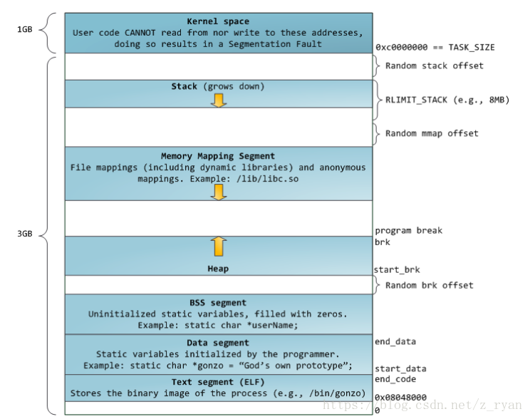

# 进程空间
## 进程空间

注意，这里的segment划分有误，应该只有两个segment，BSS和data在同一个segment。

## 关于brk和heap
在早期的unix中，heap和Data segment是连在一起的。但是在大部分的linux

## 关于stack和thread
有个问题一直困扰着我：每个线程都应该有自己的stack，但是当我查看/proc/xxx/map 时，往往只有一个stack：
```
7f68a4927000-7f68a4928000 r--p 00023000 08:01 1544                       /lib/x86_64-linux-gnu/ld-2.24.so
7f68a4928000-7f68a4929000 rw-p 00024000 08:01 1544                       /lib/x86_64-linux-gnu/ld-2.24.so
7f68a4929000-7f68a492a000 rw-p 00000000 00:00 0
7ffc5fc17000-7ffc5fc5b000 rw-p 00000000 00:00 0                          [stack]
7ffc5fd48000-7ffc5fd4b000 r--p 00000000 00:00 0                          [vvar]
7ffc5fd4b000-7ffc5fd4d000 r-xp 00000000 00:00 0                          [vdso]
```
那么其他线程的stack在哪呢？
看一个stackoverflow的[回答](https://stackoverflow.com/questions/25516602/linux-threads-and-processes)：

> Threads share the all the memory segments, including the stack segment.
Each thread has a separate stack.
Both are true. I know they sounds like contradiction.

> The first thread's stack uses the so called "stack segment". It's allocated by the kernel.

> Threads created later (e.g. created by pthread_create() or clone(CLONE_VM)) use heap (or private anonymous mmap which is the same as heap in every ways) as their stack. It's allocated by the user program and passed to clone().

> In short, each thread uses a separate stack. All the threads can read/write every other threads' stack.

所以，只有第一个线程的stack用的是真正的stack segment，其他的子线程都是用的mmap。

